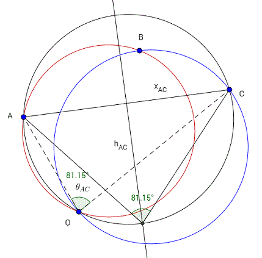

# Trifoil Compass

### Triangulation Math

Assuming all measured angles are greater than 0, the following should work for any position of the observer.

Given a line segment AB, the loci of points P such that the angle APB has a constant value are circular arcs that pass through the points A and B. In other words, if you have measured an angle θAB between the points A and B, your position must be on a particular circular arc passing through A and B. This arc can be determined when you know the angle and the position of A and B. And when you have 3 points, you can make 3 circular arcs and find their common intersection point. That point will be the position of the observer.

#### Step 1 (AB)

To find the circular arc passing through A and B, first find the bisector of AB. Now find the point on the bisector which creates an angle of θAB to the cord AB. This can be determined using the formula:

Draw a circle through this point and points A and B. The observer's position will be on this circle.

#### Step 2 (BC)

In the same way as was done above, we find the circular arc passing through B and C (the red circle is the one found above).

We see that the new circle intersects the first circle at point B (not surprising) and at the observer's position. We have now determined the observer's position.

To make absolutely sure, we can do the last circular arc:

And we have a match.

https://math.stackexchange.com/questions/1965002/calculate-position-based-on-angles-between-three-known-points
